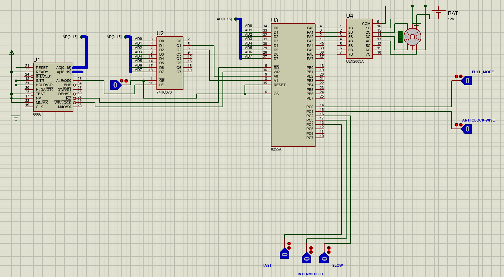
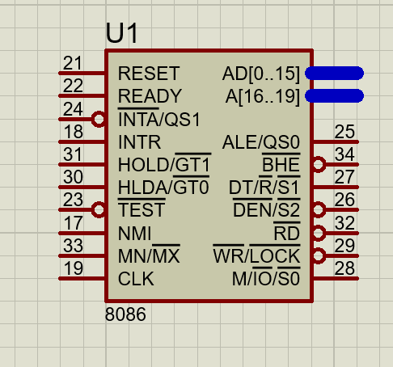
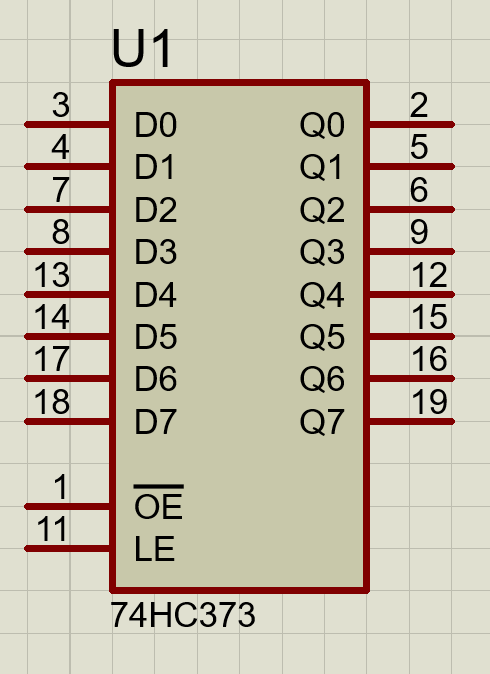
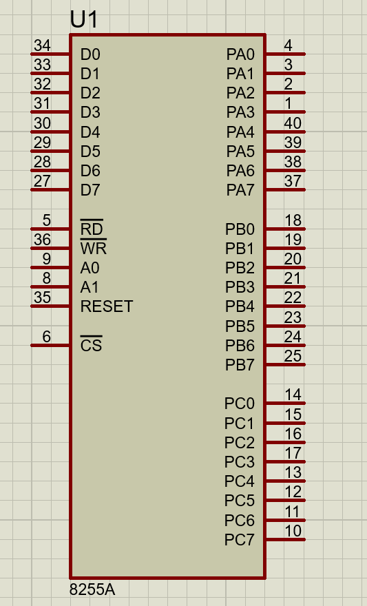
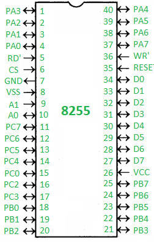
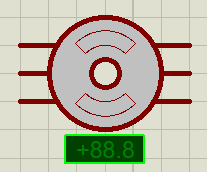

# Stepper_Motor 
## Table Of Contents
 * Introduction
 + Components
 - Explanation
    1. Modes  
    2. Directions      
    3. Speed      
 ## Introduction:     
 ### this project explains how to control -5 leads unipolar- stepper motor using 8086 micro processor This project is designed using protous 8.11
 ### Our stepper motor can work in 2 modes  :
       - full mode
       - half mode
 ### Stepper motor can rotate in two direction:
      - anti clockwise
      - clockwise
 ### Stepper motor can work in 3 different level of speeds.
 ### To control the mode , direction and speed:
 - we used  5 buttons..
    -  button to change the default mode (half mode) to the full mode .
    - button to change the direction of rotation from defalut(Clock-wise) to Anti clock-wise direction. 
    - 3 buttons to select the level of speed of rotation.
## Components of Circuit:
- 8086 microprocessor
- 74HC373 Latch
- 8255A I/O device
- Stepper Motor
- Switch (logicstate)
- 12V Battery
 ### Complete Circuit on Protus:
 
 ### 1- 8086 µp
 
 
is a 16-bit microprcessor chip designed by intel, has 20-bit address bus and 16 bit data bus ,16-bit of the address bus are multiplexed with the 16-bit data bus in AD0:AD15 and a separated 4 bits for address bus A16:A19 it  supports 64k I/O pots and provides 16-bit regs (ax,bx,...), it operates in 2   modes (max and min).it prefetches up to 6 inst bytes from memo and queue them to speed up  instruction execution
so after all 8086 µp is only the CPU of our program -processes and  executes our assembly code- so it needs to be connected to a 
storage device and an I/O device.

### 2- latch : 74HC373 

74HCT373 is an octal D-type transparent latch with 3-state outputs. The device features latch enable (LE) and output enable (OE) inputs. When LE is HIGH, data at the inputs enter the latches. In this condition the latches are transparent, a latch output will change each time its corresponding D-input changes. When LE is LOW the latches store the information that was present at the inputs a set-up time preceding the HIGH-to-LOW transition of LE. A HIGH on OE causes the outputs to assume a high-impedance OFF-state. Operation of the OE input does not affect the state of the latches. Inputs include clamp diodes. This enables the use of current limiting resistors to interface inputs to voltages in excess of VCC.

### 3- I/O device : 8255A  

PPI 8255 is a general purpose programmable I/O device designed to interface the CPU with its outside world such as ADC, DAC, keyboard etc. We can program it according to the given condition. It can be used with almost any microprocessor. 
It consists of three 8-bit bidirectional I/O ports i.e. PORT A, PORT B and PORT C. We can assign different ports as input or output functions. 
1. 8255 has:
     - 2-modes :
       - I/O mode. (The mode we use at this project).
       - BSR mode.(Not used).
     - 3-ports :
       - PortA (PA0 – PA7 – Pins) & (can work in 3 modes, we used it in mode0) & (Used as output in code)
       - PortB (PB0 – PB7 – Pins) & (can work in 2 modes, we used it in mode0) & (Not Used)
       - PortC (PC0 – PC7 – Pins) & (consist of PC upper and PC lower and works in mode0) & (Used as input in code)
     - Control register (CR)= (D0 – D7 – Data pins for the transfer of data):
       - 1. (PA0 – PA7) – Pins of port A
       - 2. (PB0 – PB7) – Pins of port B
       - 3. (PC0 – PC7) – Pins of port C
       - 4. (D0 – D7) – Data pins for the transfer of data
       - 5. RESET – Reset input
       - 6. RD – Read input
       - 7. WR – Write input
       - 8. CS – Chip select
       - 9. A1 and A0 – Address pins
       

- To make it work at mode0 we set the data as follow: (D2 = D5 = D6 =0).
- To make it work at I/O mode we set the data as follow:(D7 = 1).

###  4- Stepper motor

  

  - DC motor that move in discrete steps giving the illusion of rotation  
  - It devides the complete rotation into number of steps ,Each stepper motor will have fixed step      angle 
  - this motor is drived by L293D Motor Driver 
  -stepper motor are basically two types :Unipolar & bipolar
  <ul>
    <li><h5>unipolar :- </h5> has 5 or 6 wires ,this happens by tying each 2 coils from one end 
then there are 2 common wires as shown  , unipolar can be used as bipolar 
as we did in the project. </li>
  <li><h5>Bipolar :- </h5> has only 4 wires comming out from two coils ,there is no common wires , it can't be used as unipolar </li>
  </ul>

  
  

  

